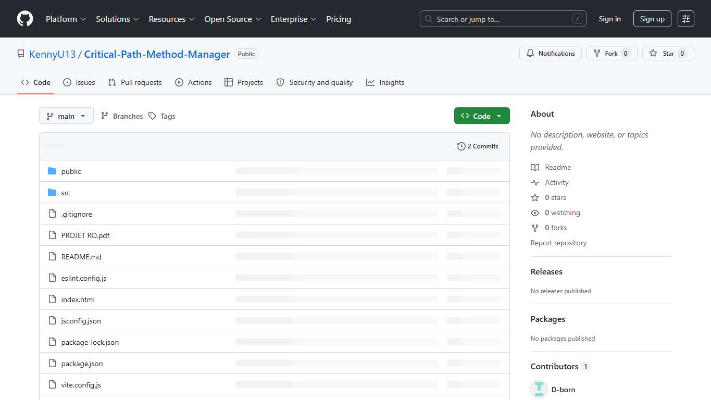

# CPM Manager

Application Vue 3 / Vite pour calculer et visualiser un graphe CPM.

## Description

CPM Manager aide a modeliser des taches, leurs durees et leurs successeurs afin de generer un graphe Mermaid, calculer les dates au plus tot / au plus tard et identifier le chemin critique.

## Demo



## Fonctionnalites

- creation d'un tableau de taches
- calcul des dates CPM
- detection du chemin critique
- generation de graphe Mermaid
- donnees d'exemple integrees
- tests unitaires sur la logique de calcul CPM

## Installation

```sh
npm install
```

## Lancement

```sh
npm run dev
```

## Tests

```sh
npm run test:unit -- --run
```

## Build

```sh
npm run build
```

## Qualite

```sh
npm run lint
npm audit
```
